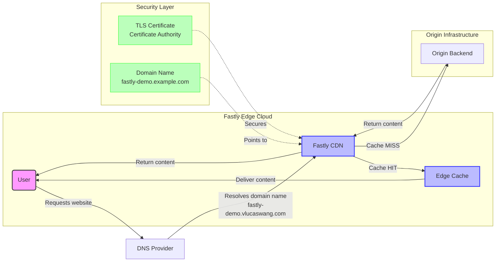
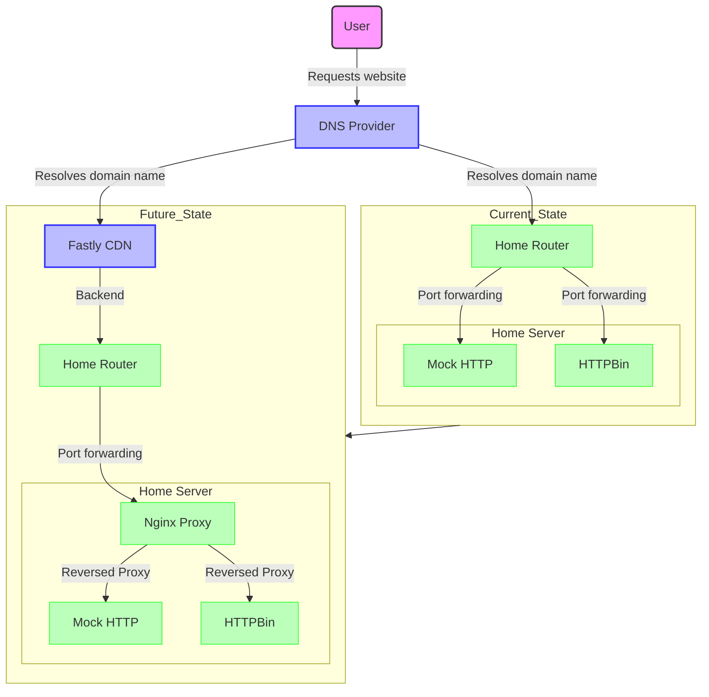

# Fastly Demo Solution Design

## Overview

This document outlines the design of a demo solution that showcases the capabilities of Fastly's edge cloud platform. The solution is designed to be simple, yet effective in demonstrating the key features and benefits of using Fastly for content delivery and edge computing.

## Objectives

- To create a demo website that showcases the capabilities of Fastly's edge cloud platform.
- The demo website should cost less than $5 per month to run.
- The demo website should be easy to set up and maintain.
- The demo website should be able to handle a moderate amount of traffic.

## Architecture

The architecture of the demo solution consists of the following components:

- **Fastly CDN**: The content delivery network that will cache and deliver the demo website's content.
- **Website Backend**: The backend server that will serve the demo website's content. This can be a simple static website hosted on a cloud provider like AWS S3, or a more complex dynamic website hosted on a cloud provider like AWS EC2.
- **Domain Name**: A domain name that will be used to access the demo website. This can be a free domain name from a provider like Freenom, or a paid domain name from a provider like GoDaddy.
- **SSL Certificate**: An SSL certificate that will be used to secure the demo website. This can be a free SSL certificate from a provider like Let's Encrypt.

## Diagram

## Current State/Future State

